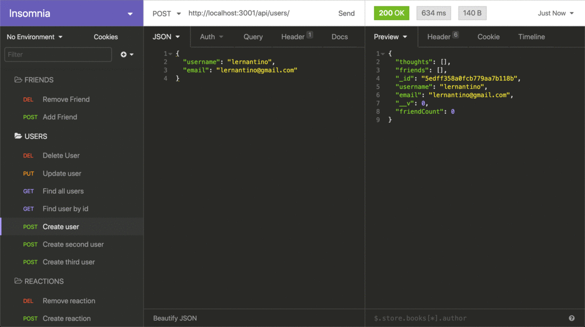
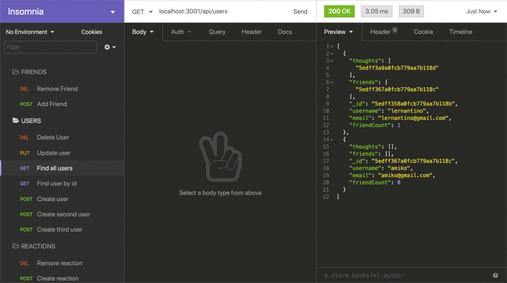
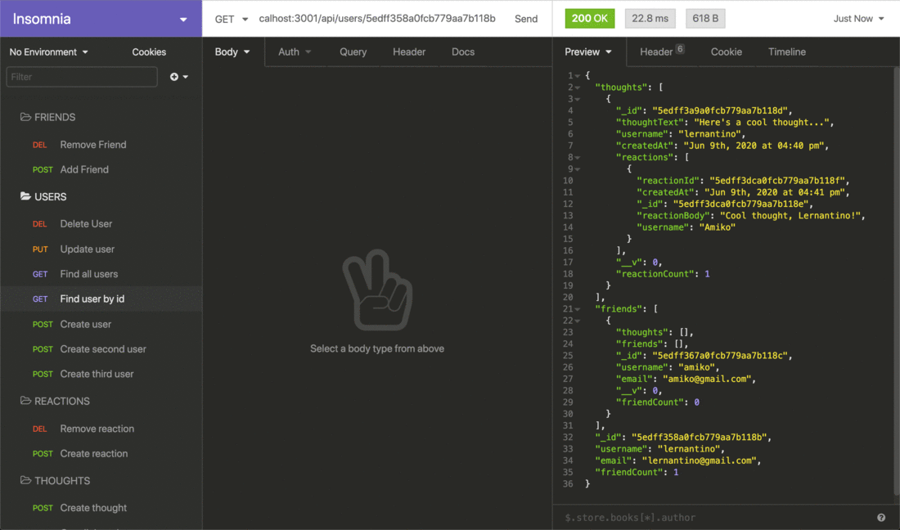
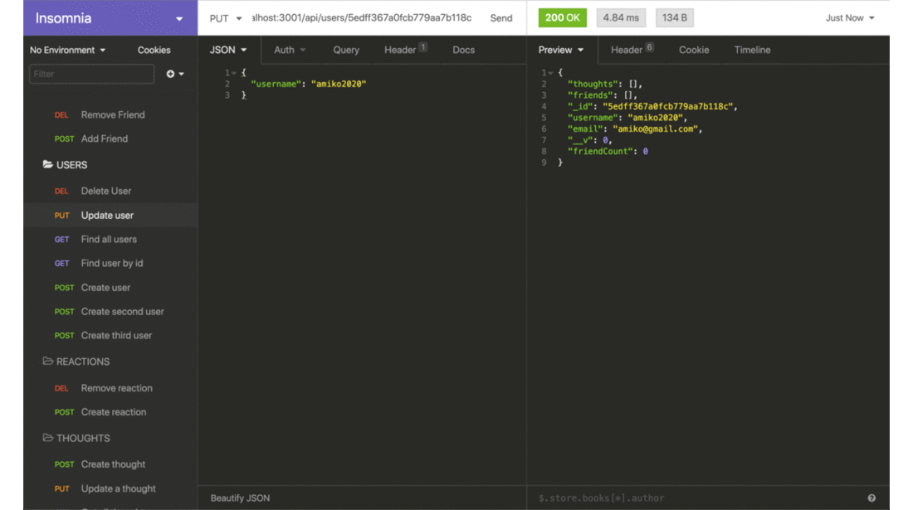
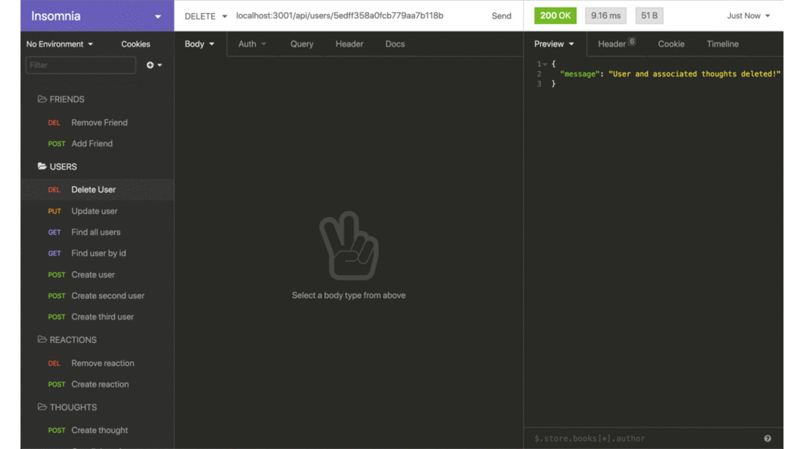
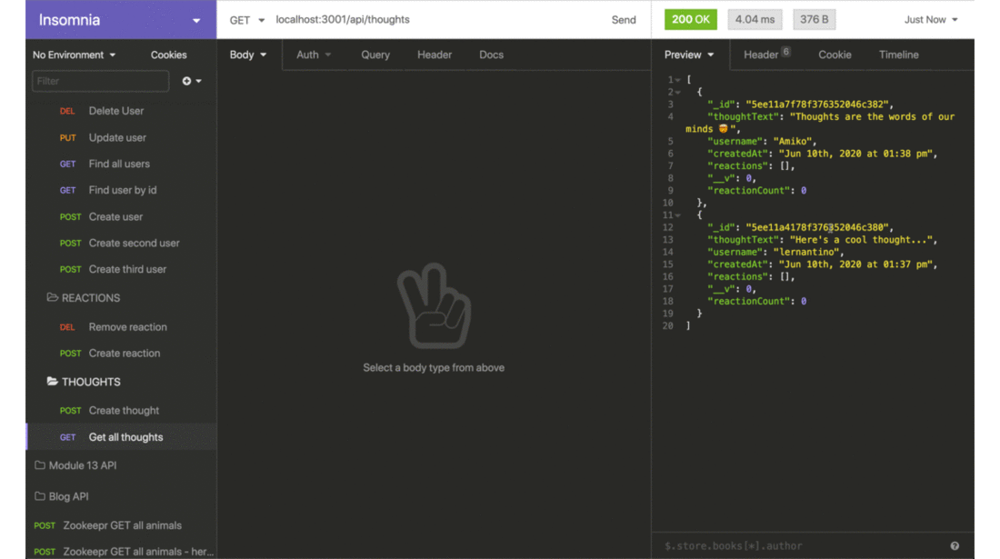
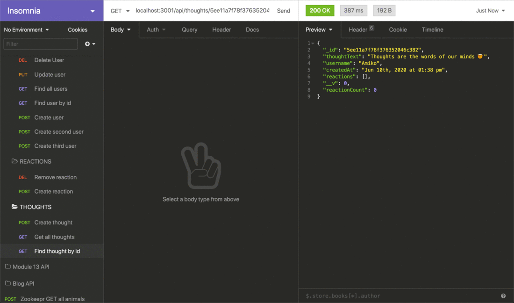
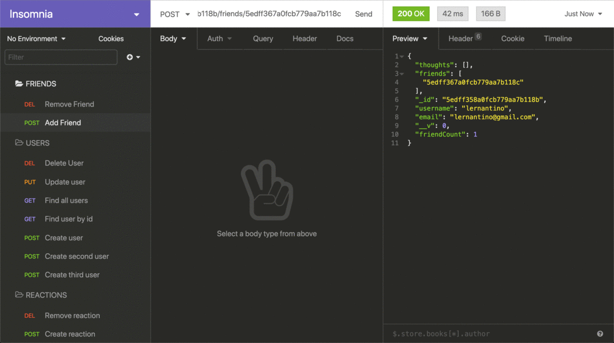
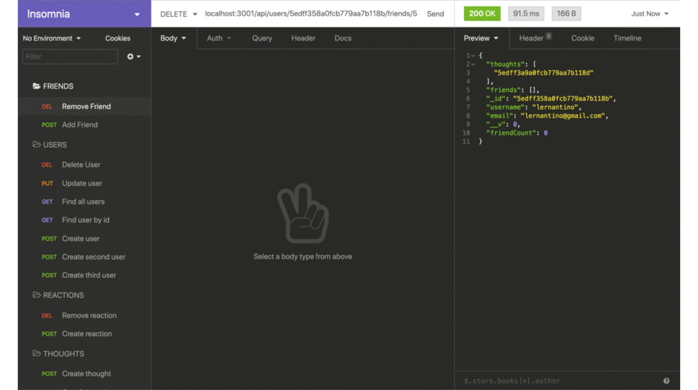

# Social Network API
<a href="#license"></img></a>

## Description
An API for a social network web application where users can share their thoughts, react to friends’ thoughts, and create a friend list.

### User Story
AS A social media startup  
I WANT an API for my social network that uses a NoSQL database  
SO THAT my website can handle large amounts of unstructured data

## Table of Contents
- <a href="#acceptance-criteria">Acceptance Criteria</a>
- <a href="#installation">Installation</a>
- <a href="#technologies-and-required-packages">Technologies and Required Packages</a>
- <a href="#usage">Usage</a>
- <a href="#mock-up">Mock-Up</a>
- <a href="#deployed-application">Deployed Application</a>
- <a href="contributors">Contributors</a>
- <a href="#license">License</a>

## Acceptance Criteria
GIVEN a social network API

WHEN I enter the command to invoke the application  
THEN my server is started and the Mongoose models are synced to the MongoDB database

WHEN I open API GET routes in Insomnia for users and thoughts  
THEN the data for each of these routes is displayed in a formatted JSON

WHEN I test API POST, PUT, and DELETE routes in Insomnia  
THEN I am able to successfully create, update, and delete users and thoughts in my database

WHEN I test API POST and DELETE routes in Insomnia  
THEN I am able to successfully create and delete reactions to thoughts and add and remove friends to a user’s friend list

## Installation
- Clone the directly from the GitHub repository to your local machine.
- Run `npm init` in the command line.
- Run `npm i` in the command line.
- Run the command `npm start` to launch the application.

### Technologies and Required Packages
- *Express.js* for routing
- *MongoDB* database
- *Mongoose* Object-Document-Mapping

## Usage
An API for a social network web applications that functions at speed with large amounts of data and flexibility with unstructured data.

## Mock-Up
**Users: Create-Read-Update-Delete**

Create User 

Read All User 

Read Single User 

Update User 

Delete User 

**Thoughts: Create-Read-Update-Delete**

Create Thought 
n/a

Read All Thought 

Read Single Thought 

Update Thought 
n/a

Delete Thought 
n/a

**Reactions to Thoughts: Update-Delete**

Update Reaction 
n/a

Delete Reaction 
n/a

**Friends: Create-Delete**

Post Friend 

Delete Friend 

## Deployed Application
Repo url: https://github.com/cpm-128/social-network-api

### Screencapture
Video Walk-through: <a href="https://drive.google.com/file/d/1VUABkrLx8SeNxgQ5ebhyHdP6DFEFhpC0/view?usp=sharing" target="_blank">Watch here.</a>

## Contributors
Colleen Maher is a front-end web developer with a background in marketing, operations, and project management.

Trained at UNC Chapel Hill to earn a Professional Certificate in full-stack web development. Newly developed skills include JavaScript, managing databases, responsive web design, and following the Model-View-Controller paradigm. I am an organized and detail-oriented coder wanting to create and contribute to improved user-experiences and database management in an increasingly digital world. Strengths in creativity, teamwork, and building projects from ideation to execution.

<a href="https://github.com/cpm-128" target="_blank">GitHub Profile</a>

## License
MIT License

Copyright (c) [2022] [Colleen Maher]

Permission is hereby granted, free of charge, to any person obtaining a copy
of this software and associated documentation files (the "Software"), to deal
in the Software without restriction, including without limitation the rights
to use, copy, modify, merge, publish, distribute, sublicense, and/or sell
copies of the Software, and to permit persons to whom the Software is
furnished to do so, subject to the following conditions:

The above copyright notice and this permission notice shall be included in all
copies or substantial portions of the Software.